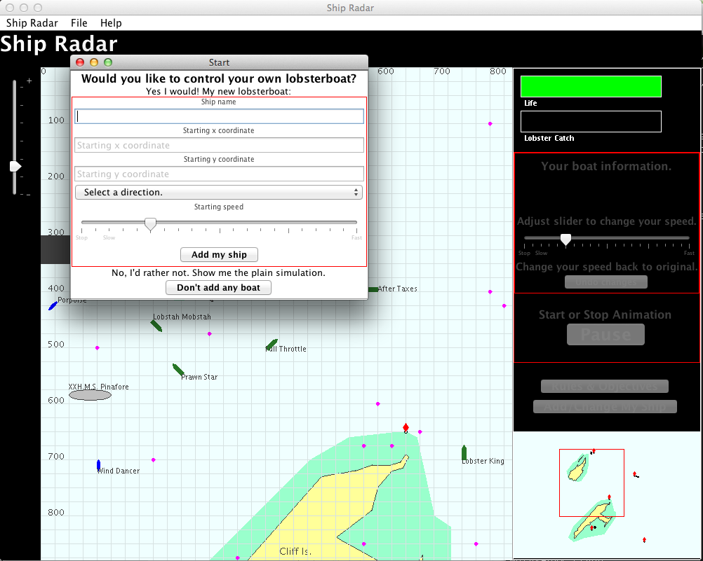
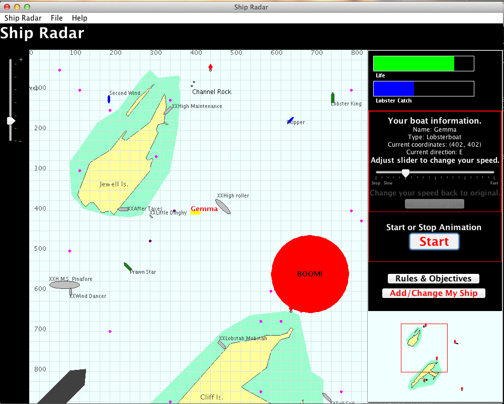
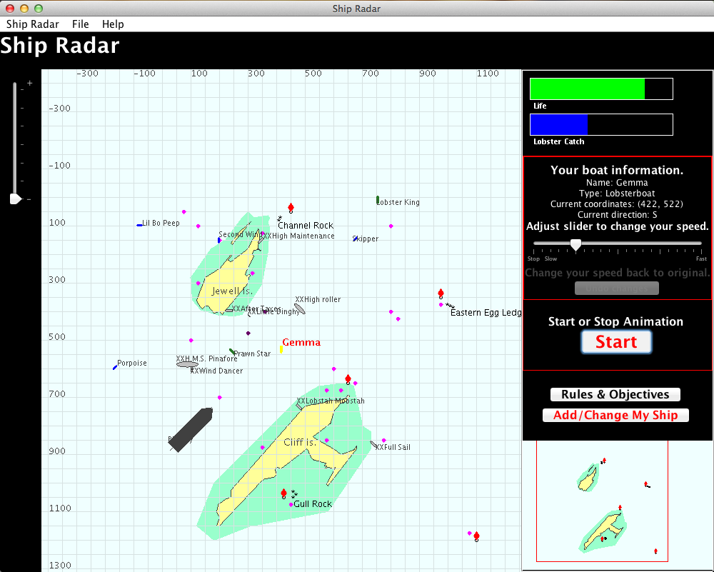
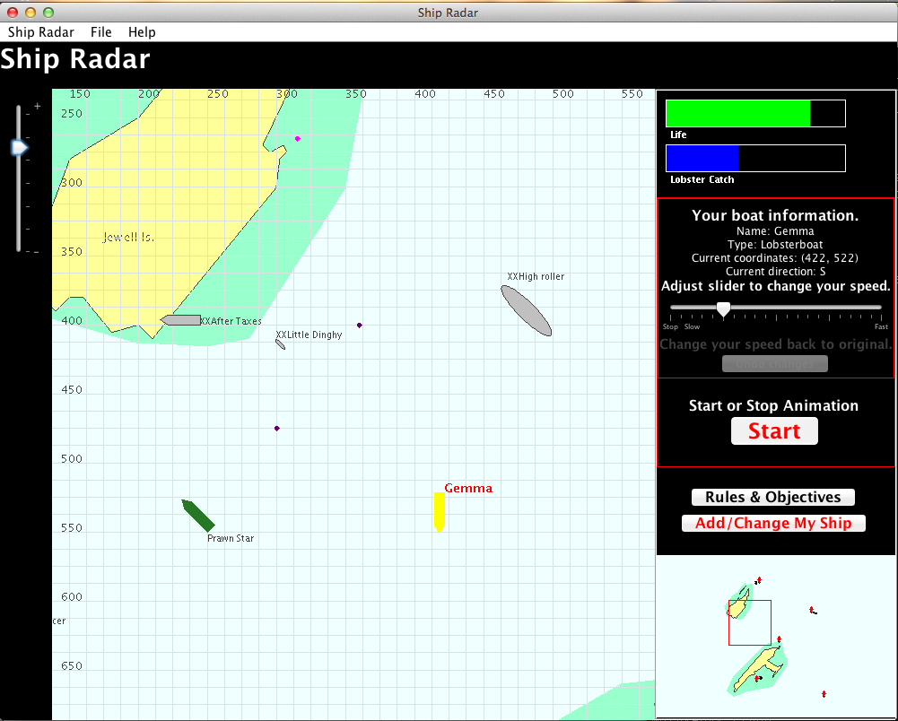

#Ship Simulation
###README
####Tufts, COMP 86: Object Oriented Programming for Graphical User Interfaces

My program has two possible ways to run -- simulation mode or game mode.
   - Simulation mode is run if the user clicks "Don't add any boat" in the first
     start window. In this mode, the user has no control over anything that
     happens in the map, but can pan and zoom in the screen as he/she wishes. If
     he/she clicks "Add/Change My Ship" in the control panel of the main window,
     the original start window will pop up again and he/she will have the option
     to create a new ship again.
   - Game mode is run if the user fills out the information to create a new
     lobsterboat, and clicks "Add my ship". After this is clicked, the status
     panel is filled in with *full* life and *empty* lobster catch. The user's
     new boat is added to the map. Then, a Rules and Objectives will pop up,
     explaining the rules/objectives of the game. I will include them here:

            Objective: Collect any 5 lobster traps from around the bay.
            
            1. How to change direction</u>: Click the map surrounding your
               lobsterboat. Your boat will point toward where you clicked.
               There are only 8 possible directions (N, NE, E, SE, S, etc.).
            2. Collisions: Unlike the other ships in the simulation, your
               boat will not sink upon the first collision. Whichever ship
               you hit will sink. You will be moved back to your starting
               location, and your life count will decrease.
               You can only die 5 times before your game will finish.
            3. How to change speed</u>: Adjust the slider on the right

####Status panel:
    The status panel in the righthand column of the main window displays the
user's status (if he/she decided to create and control a lobsterboat). The
life bar will start off full (5 lives), and the lobster bar will start off
empty (0 lobsters). Every time the user "dies", his/her life count will
decrease and the bar will display the new life count. Above 3, the life count
will appear green. At 3 or below, the life count will appear red.
    Every time the user "picks up a lobster pot", his/her lobster count will
increase and the lobster bar will display the new lobster count. The lobster
count will appear blue.

####Zooming and panning controls:
    I added the panning feature to my map, which allows the user to click-and-
drag anywhere on the map, to pan to a new view of the overall map.
In the lower right corner of the main window, there is a small overview
map that shows the entire virtual area, in addition to indicating the 
area that the large zoomed-in map currently covers. The small overview map
will update as necessary.

####Sound effects:
    I added sound effects for the tanker explosions, user collisions, and
user lobster pickups. When a tanker explodes, there is an explosion noise.
When the user collides with anything (and his/her death count goes down),
there is a down-slide noise. When the user picks up a lobster pot, there
is an upward-bell noise.

####Saving scores:
    I added a save scores feature. When the user "wins" or "loses", the game
over window will pop up saying with choices "Start over" or "Quit". If the
user selects "start over", s/he will be brought to the save scores window,
which give him/her the option of saving this last score with a
personalized name. All games from the same day will be written to the same
file, based on the date (i.e SHIP_SCORES_2013.12.10.txt). After several
times saving your score, the file will look something like this:
	  "	
		10:25:47, game1:
			Lobster Catch: 0
			Life Count: 0
		10:25:55, game2:
			Lobster Catch: 0
			Life Count: 0
		10:26:41, game3:
			Lobster Catch: 5
			Life Count: 4
	  "
